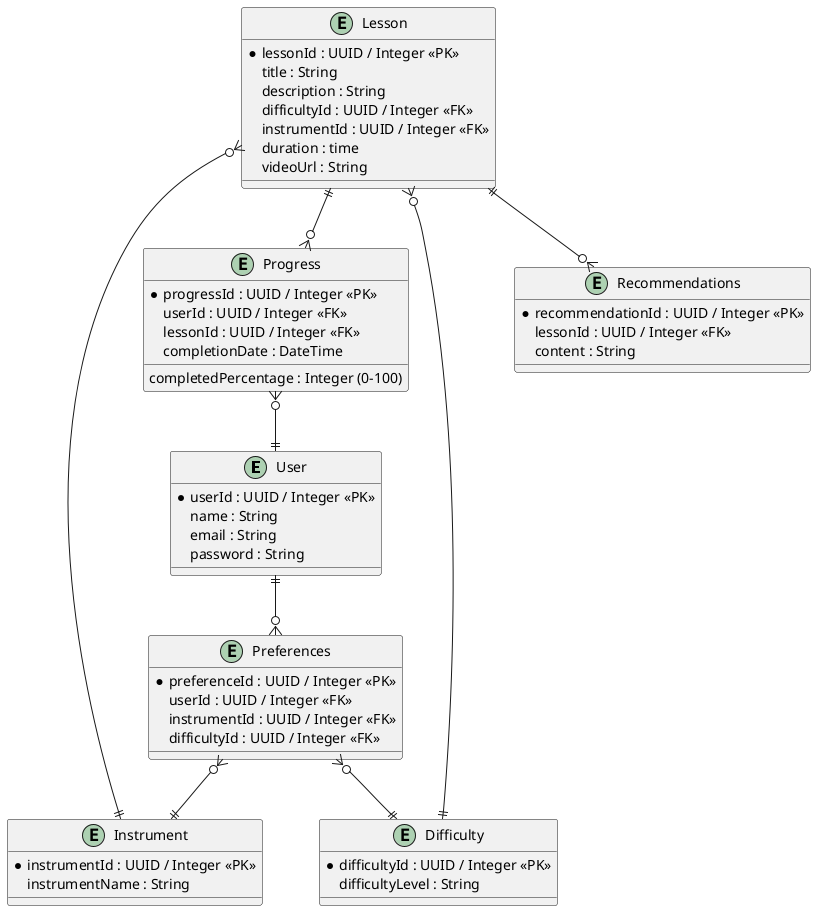

# Физическая модель БД

---
## Описание атрибутов

|   |   |   |   |
|---|---|---|---|
|Сущность|Атрибут|Тип данных|Описание|
|User|userId|UUID / Integer|Уникальный идентификатор пользователя.|
||name|String|Имя пользователя.|
||email|String (email)|Адрес электронной почты пользователя.|
||password|String|Пароль пользователя (хранить зашифрованным).|
|Preferences|preferenceId|UUID / Integer|Уникальный идентификатор предпочтений.|
||userId|UUID / Integer|Идентификатор пользователя, которому принадлежат предпочтения.|
||instrumentId|UUID / Integer|Идентификатор выбранного инструмента.|
||difficultyId|UUID / Integer|Идентификатор выбранного уровня сложности.|
|Instrument|instrumentId|UUID / Integer|Уникальный идентификатор инструмента.|
||instrumentName|String|Название инструмента (гитара, фортепиано и т.д.).|
|Difficulty|difficultyId|UUID / Integer|Уникальный идентификатор уровня сложности.|
||difficultyLevel|String|Уровень сложности (например, beginner, intermediate, advanced).|
|Lesson|lessonId|UUID / Integer|Уникальный идентификатор урока.|
||title|String|Название урока.|
||description|String|Описание урока.|
||difficultyId|UUID / Integer|Идентификатор уровня сложности урока.|
||instrumentId|UUID / Integer|Идентификатор инструмента для урока.|
||duration|Integer|Длительность урока (в минутах).|
||videoUrl|String (URL)|Ссылка на видеоурок.|
|Progress|progressId|UUID / Integer|Уникальный идентификатор прогресса.|
||userId|UUID / Integer|Идентификатор пользователя, чей прогресс отслеживается.|
||lessonId|UUID / Integer|Идентификатор урока, к которому относится прогресс.|
||completedPercentage|Integer (0-100)|Процент завершённости урока.|
||completionDate|DateTime|Дата завершения урока.|
|Recommendations|recommendationId|UUID / Integer|Уникальный идентификатор рекомендации.|
||lessonId|UUID / Integer|Идентификатор урока, для которого дана рекомендация.|
||content|String|Содержание рекомендации.|

